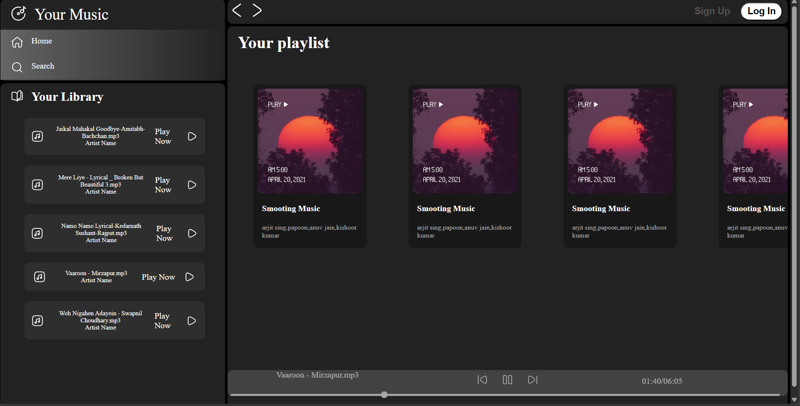
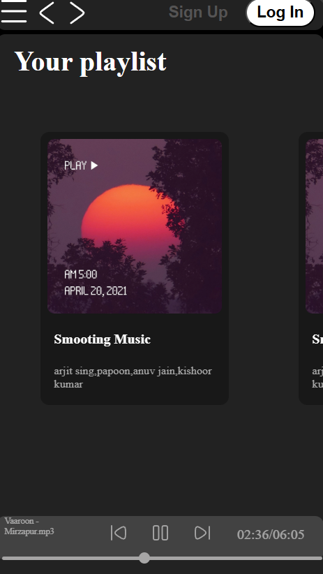
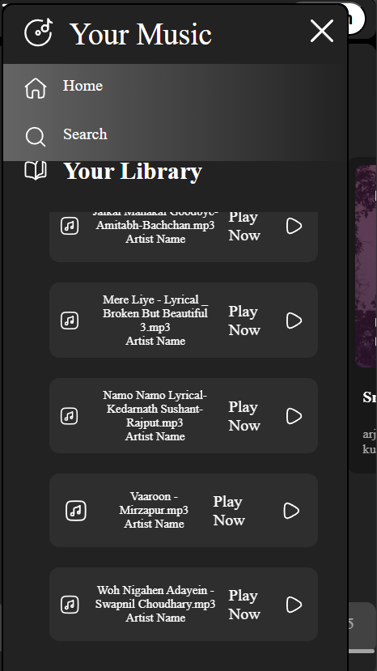

# 🎵 Music Player Web App
A responsive and interactive **Music Player Web Application** built using **HTML, CSS, and JavaScript**.
This project demonstrates core front-end development skills including DOM manipulation, audio control handling, UI design, and responsive layout creation.
---

## 📌 Project Overview

The Music Player Web App allows users to:

- ▶️ Play and Pause songs  
- ⏭️ Skip to Next track  
- ⏮️ Go to Previous track  
- 🔊 Control volume  
- 📊 Track song progress  
- 🎨 View dynamic UI updates  

This project focuses on implementing **JavaScript Audio API**, interactive controls, and modern UI styling.

---

## 🛠️ Technologies Used

- **HTML5** – Structure  
- **CSS3** – Styling & Responsive Design  
- **JavaScript (ES6)** – Functionality & DOM Manipulation  

---

## 📂 Project Structure
```
music-player/
│
├── index.html
├── style.css
├── script.js
└── assets/
    ├── songs/
    └── images/
```

---

## 🎯 Features
✔️ Interactive Play / Pause Button  
✔️ Next & Previous Song Controls  
✔️ Progress Bar with Time Update  
✔️ Volume Control  
✔️ Responsive Design  
✔️ Clean UI Layout  
✔️ Dynamic Song Information Display  
---

## 🖥️ How to Run the Project
1. Download or clone the repository:
```bash
git clone https://github.com/your-username/music-player.git
```
2. Open the project folder.
3. Double-click `index.html`  
4. Enjoy the music 🎧
---

## 🧠 Learning Objectives
- Understanding HTML Audio Element
- DOM Manipulation in JavaScript
- Event Handling
- Responsive Design using CSS
- Clean UI structuring
- State Management in JS
---

## 📸 Screenshots


## 📸 Screenshots

### 🎵 Main Player Interface


### 📱 Playing State


### 📱 Responsive Design

---
## 💡 Future Improvements
- Playlist Feature  
- Shuffle & Repeat Modes  
- Dark/Light Theme Toggle  
- Search Songs Feature  
- Backend Integration  
- Save Favorite Songs  
---

## 🏆 Skills Demonstrated
- Frontend Development  
- UI/UX Design  
- JavaScript Logic Implementation  
- Clean Code Structure  
- Responsive Layout Design  
---

## 📌 Conclusion
This Music Player Web App is a practical demonstration of front-end development skills using **HTML, CSS, and JavaScript**, focusing on real-world UI behavior and interactive functionality.
---

## 👨‍💻 Author
**Unmesh Patil**
- Leetcode:
- 
If you like this project, give it a ⭐ on GitHub!
